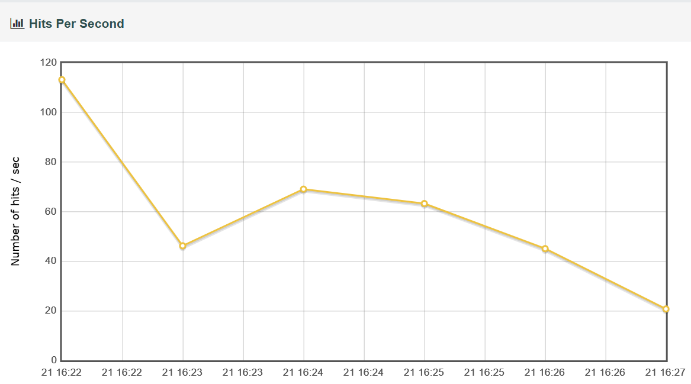
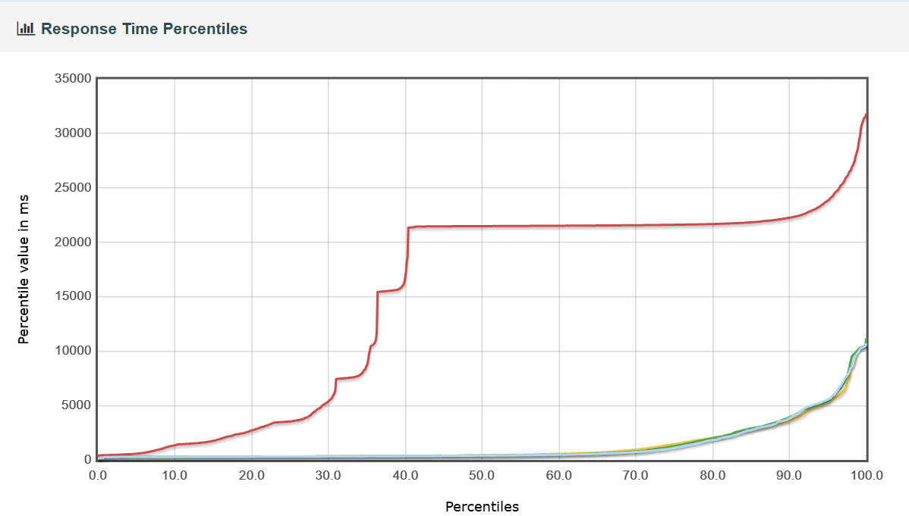

# 🧪 Análise dos Resultados dos Testes de Performance

---

## 🎯 Critérios de Aceitação

| Critério | Valor Esperado |
|-----------|----------------|
| **Vazão mínima** | 250 requisições por segundo |
| **Tempo de resposta (90th percentil)** | < 2 segundos |

---

## ⚙️ Teste de Carga

Durante o **teste de carga**, o sistema iniciou com boa performance, atingindo cerca de **115 requisições por segundo**.  
Porém, após esse pico inicial, a **vazão caiu consideravelmente**, estabilizando entre **45 e 70 req/s** e, ao final do teste, chegando próximo a **20 req/s**.  

➡️ Isso indica que o sistema **não conseguiu sustentar a vazão mínima** exigida pelo critério de aceitação.

📊 **Gráfico de Vazão do Teste de Carga**

> Queda de vazão observada ao longo do teste de carga.

---

## 🚀 Teste de Pico

No **teste de pico**, o foco foi a análise dos **tempos de resposta**.  
Até o percentil 30, os tempos estavam aceitáveis.  
A partir desse ponto, houve um aumento acentuado — nos percentis mais altos, **os tempos ultrapassaram 20 segundos**, chegando a **mais de 30 segundos** em alguns casos.  

➡️ Sob alta demanda, o sistema apresentou **lentidão significativa para uma parcela relevante dos usuários**.

📈 **Gráfico Percentil do Tempo de Resposta**

> Aumento dos tempos de resposta nos percentis mais altos.

---

## 🧾 **Conclusão**

> 💡 O sistema **não atendeu aos critérios de aceitação**:  
> não manteve a **vazão mínima** e apresentou **tempos de resposta elevados** no *90th percentil*.

---

## ⚠️ **Possíveis Causas**

🔹 **Saturação** do servidor ou do banco de dados  
🔹 **Gargalos** na aplicação ou na infraestrutura  
🔹 **Configuração inadequada** do ambiente

---

## 🧩 **Recomendações**

Recomenda-se:  

1. **Investigar detalhadamente** os recursos do ambiente (CPU, memória e banco de dados).  
2. **Revisar as configurações do teste** para garantir representatividade
3. **Otimizar a aplicação** ou **reforçar a infraestrutura**, conforme os achados, a fim de alcançar os critérios estabelecidos.

